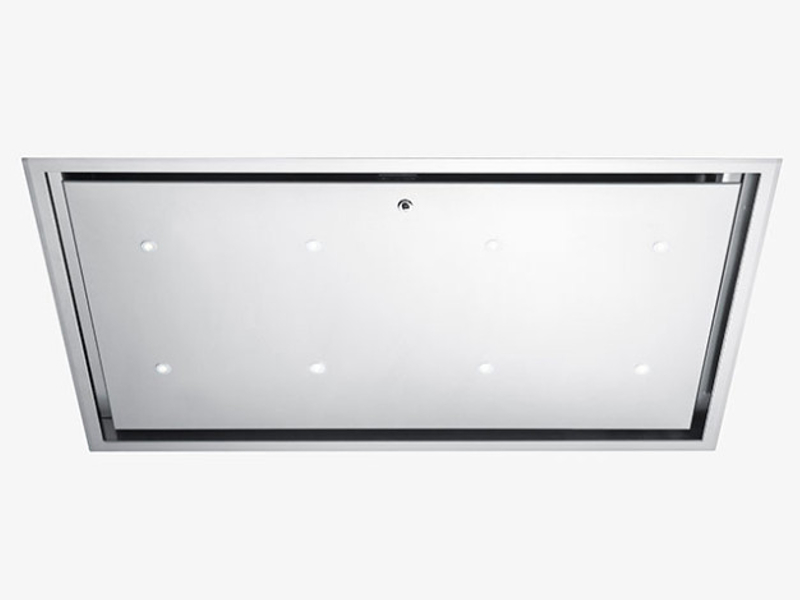
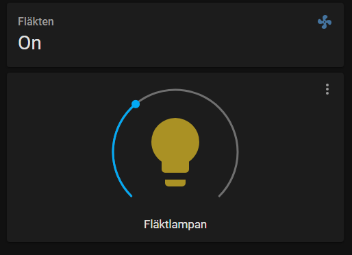
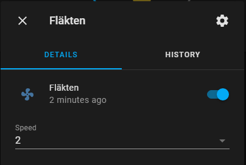
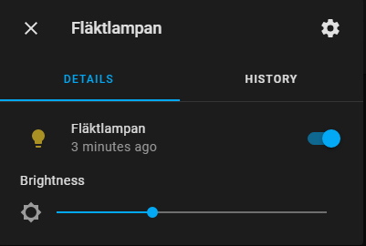

# Integration of Fjäråskupan (a kitchen fan) to Home Assistant

https://www.fjaraskupan.se/

There are several models of Fjäråskupan, this has been tested with model Athena. It has to have bluetooth, which is normally used for communication with their app, https://play.google.com/store/apps/details?id=com.vntrs.fjaraskupan.

Fjäråskupan, model Athena.

The fan has three normal speeds and three intensive speeds and the light can be adjusted 0 - 100%.

The integration is accomplished with a Raspberry Pi 3 Model B+ that is placed close to the fan. It communicates via bluetooth to the fan. Home Assistant is running on another computer and calls scripts through ssh over WiFi on the Raspberry Pi.  
It work fairly well, maybe one time in 50 it fails due to bluetooth connectivity problems. Haven't figured out why though.

In Home Assistant there is a light template for controlling the light and a fan template or the fan. It's all collected in the package files kitchen_fan_light.yaml and kitchen_fan.yaml. These two files can be placed in the packages folder of HA or the respective parts copied to their respective yaml-files.  

## Installation

The Raspberry Pi has to be setup to use Bluetooth LE, a good instruction of how to do this can be found here:  
https://www.instructables.com/Control-Bluetooth-LE-Devices-From-A-Raspberry-Pi/
  
Then copy the script files to the Raspberry Pi and set the MAC address in mac_address.sh. The MAC address can be obtained with e. g. Bluetooth Mac Finder for Android.
  
If you are using packages in HA, copy the two yaml-files to that folder.
Adjust the IP address, path to scripts on the Raspberry Pi and the path to the ssh key-file, id_rsa. If running in a docker container it may need to be copied to e. g. /usr/share/hassio/homeassistant/.ssh/.